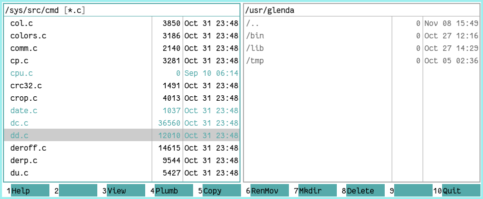

nc
===
nein commander is a two-pane file manager for plan9 inspired by the likes of midnight commander.
nc is mainly keyboard-driven, see the internal help for a list of available shortcuts.



Installation:
-------------
```sh
% git/clone <repository_url>
% cd nc
% mk
% mk install
```

Missing features:
-----------------
nc is in early alpha stage and all features are not yet implemented:
- dirview: text can overflow columns
- most file ops are not implemented (copy, move, ...)
- no sorting
- ...

Author:
-------
phil9

License:
--------
MIT

Bugs:
-----
Look and you shall find.
